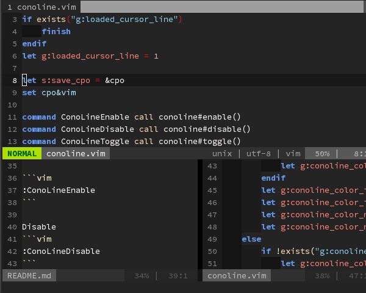
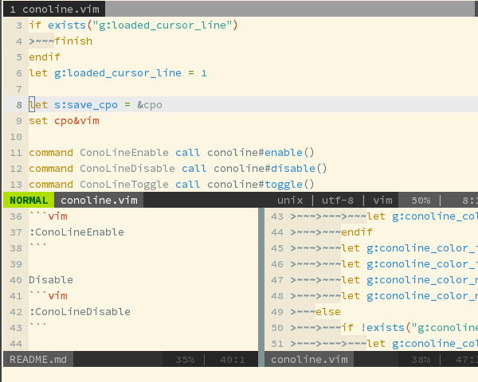

Conoline.vim
============

This plugin highlights the line of the cursor, only in the current window. The colors change according to the mode (normal/insert). Colors in each mode can be independently customizable.

This plugin is inspired by this post:  
(http://vimblog.hatenablog.com/entry/vimrc_autocmd)

Screencasts
------------

### Dark colorscheme ([slateblue](https://github.com/miyakogi/slateblue.vim))



### Light colorscheme ([solarized](https://github.com/altercation/vim-colors-solarized))



Installation
------------

If you are a NeoBundle user, add the following line in your vimrc.

```vim
NeoBundle 'miyakogi/conoline.vim'
```

Then reload vim and execute `:NeoBundleInstall`.

Usage
-----

Enable

```vim
:ConoLineEnable
```

Disable
```vim
:ConoLineDisable
```

Toggle on/off

```vim
:ConoLineToggle
```

Configuration
-------------

### Autostart

If you want to automatically enable this plugin, add the below line in your vimrc.

```vim
autocmd VimEnter * ConoLineEnable
```

### Colors

You can define 'four' color-sets, each for dark/light backgrounds.

- Cursorline in the normal mode (overwrite `CursorLine`)
- Number of the cursorline in the normal mode (overwrite `CursorLineNr`)
- Cursorline in the insert mode (overwrite `CursorLine`)
- Number of the cursorline in the insert mode (overwrite `CursorLineNr`)

Please see the following examples. You can use the same syntax as used in colorscheme files.

#### Examples

When you set 'backround=dark'

```vim
let g:conoline_color_normal_dark = "guibg=#333333 guifg=#dddddd"
let g:conoline_color_insert_dark = "guibg=black guifg=white"
If you set 'background=light', change the suffix from 'dark' to 'light'.
```

Of course, you can set colors used in terminals.

```vim
let g:conoline_color_normal_dark = "guibg=#333333 guifg=#dddddd gui=None "
                           \. "ctermbg=grey ctermfg=white"
let g:conoline_color_insert_dark = "guibg=black guifg=white gui=bold "
                           \. "ctermbg=black ctermfg=white"
```

If you are using light theme (`set background=light`), please change suffix from `_dark` to `_light`.

### Use colors defined by the colorschemes

You can use colors defined by the colorscheme, for either or both in normal/insert modes.

For example, if you use colorscheme's color in the normal mode, add the following line in your vimrc.

```vim
let g:conoline_use_colorscheme_default_normal=1
```

In this case, the options beginning with `g:conoline_color_normal_` are ignored, and in the normal mode, color of the cusorline is defined by the colorscheme.

If you want to use the color set by the colorscheme in insert mode, use the following option.

```vim
let g:conoline_use_colorscheme_default_insert=1
```
